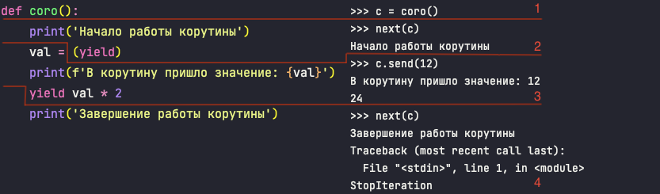

Передача данных в генератор:

```python
>>> def coro():
...     print('Начало работы корутины')
...     val = (yield)
...     print(f'В корутину пришло значение: {val}')
...     yield val * 2
...     print('Завершение работы корутины')
... 
>>> c = coro()
>>> next(c)
Начало работы корутины
>>> c.send(12) # метод send генератора передает данные в функцию
В корутину пришло значение: 12
24
>>> next(c)
Завершение работы корутины
Traceback (most recent call last):
  File "<stdin>", line 1, in <module>
StopIteration
```

Последовательность исполнения:



Как типизировать декоратор для корутин [ссылка](doc/decorators.md)

Запуск проекта:
```shell
docker compose up -d
uv sync
cd src
uv run python data_injector.py
uv run python main.py
```
